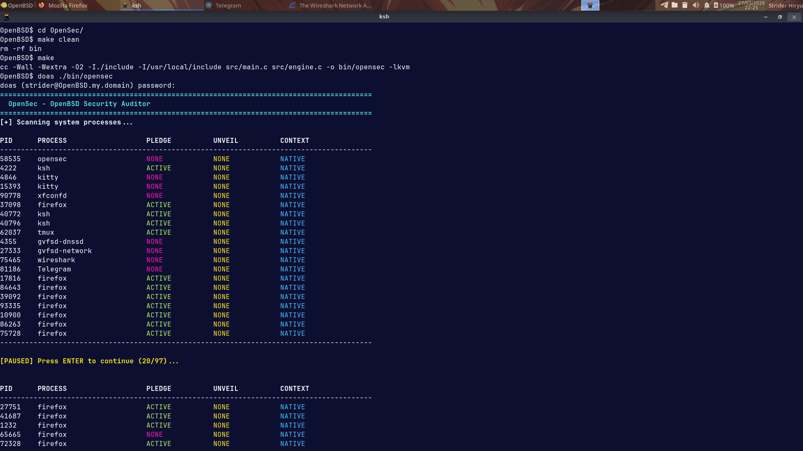
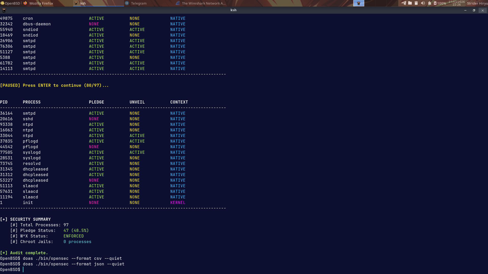
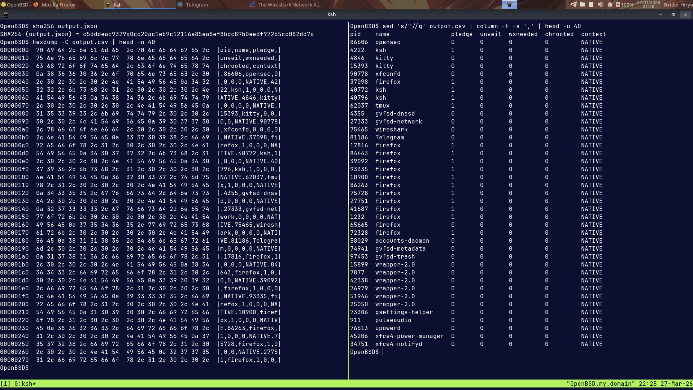

# OpenSec
A lightweight process mitigation auditing tool for OpenBSD.

---

## Overview

OpenSec is a minimal auditing utility designed specifically for OpenBSD systems.

It inspects kernel-exposed process metadata via kvm(3) and struct kinfo_proc
to determine whether core mitigation mechanisms are active, including:

- pledge(2)
- unveil(2)
- W^X enforcement indicators

The objective is deterministic classification of process security posture
based strictly on kernel state.

OpenSec does not perform tracing, instrumentation, or behavioral inference.

---

## Why

OpenBSD provides strong built-in mitigation primitives.
However, visibility into which processes actively enforce them is not centralized.

OpenSec provides a deterministic mitigation visibility layer for:

- System auditing
- Hardening validation
- Forensic triage
- Security posture verification

It focuses purely on observable kernel state.

---

## How It Works

OpenSec interfaces with libkvm to access the kernel process table in read-only mode.

For each process entry, it evaluates fields within struct kinfo_proc
and related metadata to determine:

- Whether pledge(2) restrictions are enforced
- Whether unveil(2) restrictions are present
- Whether memory protection flags align with W^X principles

Classification is derived exclusively from kernel-reported state.

The tool does not:

- Attach via ptrace
- Instrument binaries
- Modify process memory
- Inject runtime code

All inspection is passive and non-intrusive.

---

## Example Output

PID   USER    PLEDGE   UNVEIL   W^X   CLASSIFICATION
123   root    YES      YES      OK    Hardened
456   www     YES      NO       OK    Partial
789   user    NO       NO       WEAK  Unrestricted

Output reflects kernel-reported mitigation state only.

---

## Design Philosophy

OpenSec follows OpenBSD principles:

1. Simplicity
2. Correctness
3. Determinism
4. Non-Intrusiveness

The tool is intentionally conservative in scope.

---

## Limitations

- Relies strictly on kernel-exposed metadata
- Does not analyze binary logic or runtime intent
- Cannot detect logical flaws inside pledged processes
- Does not perform memory dumping or syscall tracing
- Requires appropriate privileges for kernel memory access

Mitigation absence does not automatically imply malicious behavior.

---

## Project in Action

Figure 1: Automated baseline evaluation of the global security posture.

Figure 2: Real-time monitoring of active security primitives and privilege levels.

Figure 3: Forensic audit reporting with global mitigation statistics and risk assessment.

---

## Features

- Kernel process table inspection via libkvm
- pledge(2) enforcement detection
- unveil(2) state reporting
- W^X-related enforcement indicators
- Userland vs kernel process differentiation
- Deterministic classification model
- Clean terminal output
- Minimal runtime footprint

---

## Operational Integrity

OpenSec is designed for stability in live OpenBSD environments:

- Read-only kernel state access
- Graceful handling of restricted entries
- No process interruption
- No execution state modification

Suitable for live auditing and hardening validation.

---

## Investigation Workflow

If a process is classified without active mitigations,
further analysis may include:

Syscall auditing:
ktrace -p [PID] && kdump

File descriptor inspection:
fstat -p [PID]

Binary verification:
sha256 /path/to/binary

OpenSec serves as an initial mitigation visibility layer
within a broader forensic workflow.

---

## Deployment

Requirements:

- OpenBSD (stable or current)
- libkvm
- BSD make
- doas or root privileges

Build and execute:

git clone https://github.com/jeffersoncesarantunes/OpenSec.git
cd OpenSec
make clean && make
doas ./bin/opensec

---

## Tech Stack

Language: C (C99/C11 with OpenBSD extensions)
Kernel Interface: libkvm
Data Source: struct kinfo_proc
Build Tool: BSD make
Target Platform: OpenBSD

---

## Roadmap

- Kernel-level mitigation detection engine (Completed)
- Process-type differentiation (Completed)
- Structured export format (CSV/JSON)
- Interactive TUI interface
- Historical mitigation state tracking
- Extended W^X validation research

---

## License

Distributed under the MIT License.
See LICENSE file for details.

Developed as a practical exploration of OpenBSD process
mitigation visibility and kernel state auditing.
