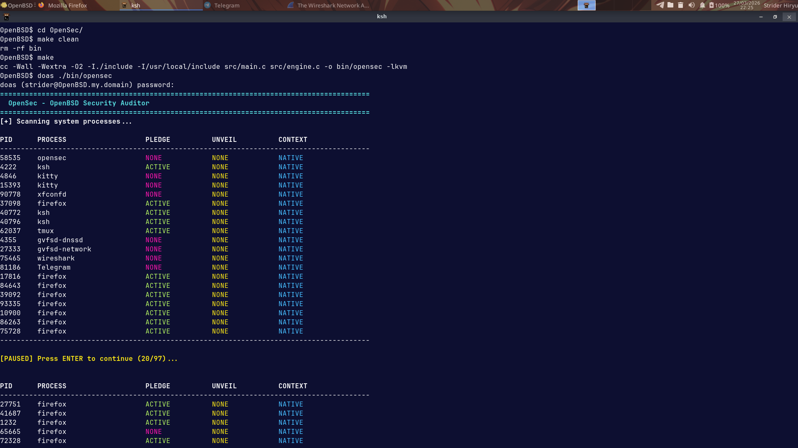
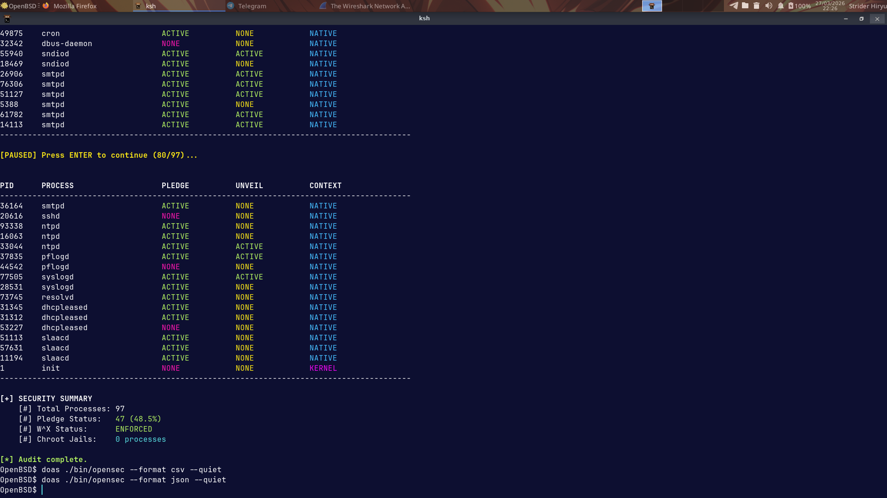
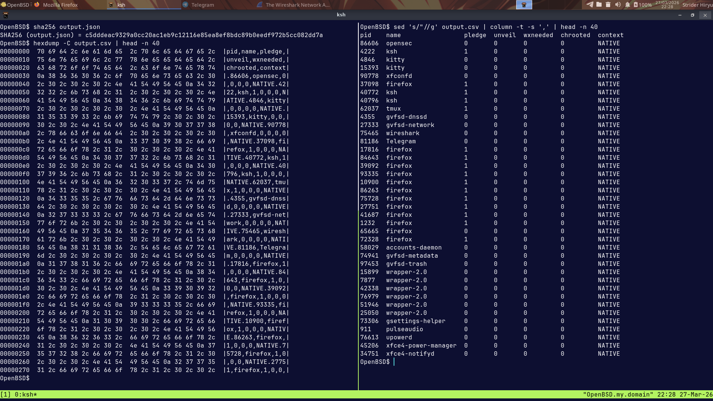

# 🐡 OpenSec

Lightweight OpenBSD process mitigation auditing tool focused on pledge, unveil, and W^X visibility.

[](https://www.openbsd.org)
[](https://gcc.gnu.org/)
[](LICENSE)


## 🌐 Contact

[](https://discord.com/users/1476405883733807247)
[](https://x.com/j3ff3rsonc3sar)
[](https://mastodon.social/@jeffersoncesar)

> **Project:** OpenSec (Open Security Auditor)  
> **Author:** Jefferson Cesar Antunes  
> **License:** MIT  
> **Version:** 1.0.0  
> **Description:** Passive kernel-state mitigation auditing tool for OpenBSD.

## ● Etymology & Origin

The name OpenSec was born from the fusion of Open and Security, directly inspired by the OpenBSD philosophy.

In this context, Open represents more than free software. It stands for absolute transparency, auditability, and deterministic security design.

OpenSec reflects the principle that security tools must be inspectable, minimal, and free from hidden logic.  
It is security through clarity.

## ● Overview

OpenSec is a minimal forensic utility designed to audit process-level mitigation mechanisms on OpenBSD.

It inspects kernel-exposed process metadata through:

    kvm(3)
    struct kinfo_proc (kernel process table)

The tool evaluates whether active processes enforce core security primitives such as:

    pledge(2)
    unveil(2)

Additionally, it inspects kernel metadata that may indirectly indicate W^X enforcement behavior.

Classification is derived strictly from kernel-reported state.

OpenSec does not perform tracing, behavioral inference, or runtime instrumentation.

## ● Why

OpenBSD provides strong built-in mitigation primitives. However, visibility into which processes actively enforce them is not centralized.

OpenSec provides:

- Deterministic mitigation visibility
- System-wide process auditing
- Hardening validation support
- Live forensic triage assistance
- Security posture verification

The focus remains exclusively on observable kernel metadata.

## ● How It Works

OpenSec interfaces with **libkvm** to access the kernel process table in read-only mode.

For each active process, it evaluates fields within **struct kinfo_proc** to determine:

- Whether pledge restrictions are active
- Whether unveil restrictions are present
- Whether memory protection aligns with W^X principles

All inspection is passive.

The tool does not:

- Attach via ptrace
- Inject code
- Modify process memory
- Suspend execution
- Instrument binaries

## ● Example Output

```text
PID      PROCESS           PLEDGE          UNVEIL          CONTEXT
--------------------------------------------------------------------
89905    opensec           NONE            NONE            NATIVE
80996    ksh               ACTIVE          NONE            NATIVE
96837    xfce4-terminal    NONE            NONE            NATIVE
20033    firefox           ACTIVE          NONE            NATIVE
18100    firefox           NONE            NONE            NATIVE
79750    accounts-daemon   NONE            NONE            NATIVE
```

*Output reflects kernel-reported mitigation state only.*

## ● Project in Action


*1- Automated baseline evaluation.*


*2- Real-time monitoring of active mitigation primitives.*


*3- Forensic audit reporting and mitigation statistics.*

## ● Features

- Kernel process table inspection via `libkvm`
- `pledge(2)` enforcement detection
- `unveil(2)` state reporting
- W^X-related enforcement indicators
- Deterministic classification model
- Clean terminal output
- Minimal runtime footprint

## ● Operational Integrity

OpenSec is built for stability and forensic neutrality:

- Read-only kernel state access
- No process interruption
- No execution state modification
- Graceful handling of restricted entries

## ● Investigation Workflow

After identifying processes without active mitigations, analysts may proceed with:

```bash
# Syscall auditing
ktrace -p [PID] && kdump
```

```bash
# File descriptor inspection
fstat -p [PID]
```

```bash
# Binary verification
sha256 /path/to/binary
```

OpenSec serves as a mitigation visibility layer within a broader forensic workflow.

## ● Deployment

**Requirements:**

- OpenBSD (release or -current)
- libkvm
- BSD make
- doas or root privileges

## ● Build and Run

```bash
# Clone the repository
git clone https://github.com/jeffersoncesarantunes/OpenSec.git

# Enter the project directory
cd OpenSec

# Build the project
make

# Run OpenSec (requires root privileges)
doas ./bin/opensec
```

## ● Tech Stack

- **Language:** C (C99/C11 with OpenBSD extensions)
- **Kernel Interface:** libkvm
- **Data Source:** struct kinfo_proc
- **Build Tool:** BSD make
- **Target Platform:** OpenBSD

## ● Roadmap

- [x] Core mitigation auditing engine
- [x] pledge(2) / unveil(2) visibility
- [x] Kernel state extraction via libkvm(3)
- [ ] Structured export formats (JSON / CSV)
- [ ] Integration with sha256 for binary integrity validation
- [ ] Fine-grained W^X violation detection

## ● License

Distributed under the MIT License. See [LICENSE](./LICENSE) for details.
