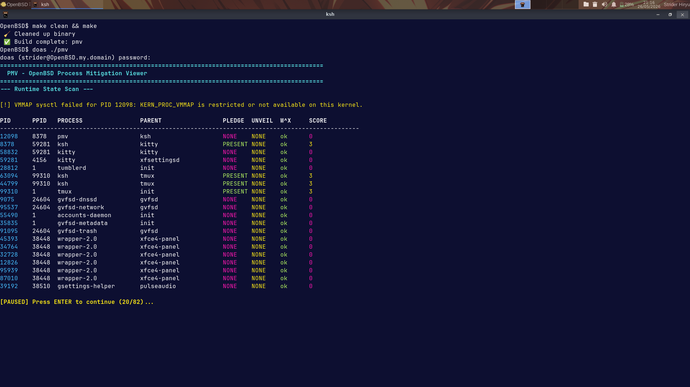
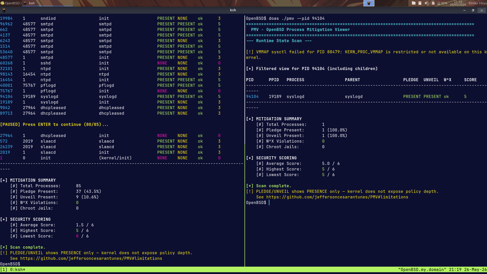
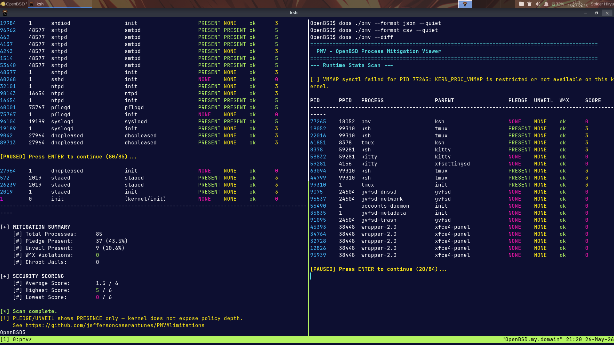

# 🐡 PMV

Lightweight OpenBSD process mitigation visibility tool focused on pledge, unveil, and W^X status.

[](https://www.openbsd.org)
[](https://gcc.gnu.org/)
[](LICENSE)
[](#-roadmap)
[](https://www.openbsd.org/78.html)
[](./docs/SECURITY_MODEL.md)

---

## ● Etymology & Origin

**PMV** stands for **P**rocess **M**itigation **V**iewer. The name was chosen deliberately — this is a **viewer**, not an auditor, not a security scanner, not a vulnerability finder. It shows the presence or absence of kernel mitigations per process, and is explicit about the limits of what the kernel exposes.

---

## ● Overview

PMV is a minimal utility designed to inspect and display process-level mitigation state on OpenBSD.

It inspects kernel-exposed process metadata using `kvm(3)` and `struct kinfo_proc` to evaluate whether active processes enforce `pledge(2)`, `unveil(2)`, and W^X policy.

All classification is based strictly on kernel-reported state — PMV does not perform runtime analysis, syscall tracing, or behavioral detection.

**On scope and honesty:** PMV does not attempt to replace `ktrace(1)`, `btrace(8)`, or any existing OpenBSD introspection tool. It simply reads what the kernel already exposes and displays it in a readable format. The kernel exposes whether `pledge(2)` and `unveil(2)` were called — not which promises were made or which paths were unveiled. PMV does not pretend otherwise. This is a design constraint of the platform, not a missing feature.

---

## ● Features

* Kernel process table inspection via `libkvm`
* `pledge(2)` state detection (called / not called)
* `unveil(2)` state detection (called / not called)
* W^X-related indicators
* PID filtering (`--pid`) — inspect a single process and its children
* Parent process mapping (PPID) — show parent PID and process name
* Per-process scoring based on kernel-reported mitigation state
* Self-hardening — PMV applies `pledge(2)` and `unveil(2)` to itself at runtime
* Self-audit — automatic W^X memory verification of its own process on startup
* Structured export (JSON, CSV)
* Diff mode (`--diff`) — compare current state against previous snapshot
* W^X memory scan (`--scan-wx`) — per-region protection analysis with violation summary
* Built-in help (`--help` / `-h`) — usage reference for all flags

---

## ● Example Output

```text
PID      PPID   PROCESS                PARENT                 PLEDGE  UNVEIL  W^X     SCORE
-----------------------------------------------------------------------------------------------------
89905    57770  pmv                    ksh                    PRESENT PRESENT ok      5
80996    57770  ksh                    xfce4-terminal         PRESENT NONE    ok      3
96837    1      xfce4-terminal         init                   NONE    NONE    ok      0
20033    38074  firefox                firefox                PRESENT NONE    ok      3
18100    20033  firefox                firefox                NONE    NONE    ok      0
79750    1      accounts-daemon        init                   NONE    NONE    ok      0
```

*Output reflects kernel-reported mitigation state. `PRESENT` confirms the syscall was called — it does not indicate policy depth or scope.*

---

## ● How It Works

PMV interfaces with **libkvm** to access the kernel process table in read-only mode. For each process, it reads `struct kinfo_proc` to determine:

* Whether `pledge(2)` was called (`p_psflags & PS_PLEDGE`)
* Whether `unveil(2)` was called (`p_psflags & PS_UNVEIL`)
* Whether W^X enforcement is active (`p_psflags & PS_WXNEEDED`)
* Whether the process is chrooted (`p_flag & P_CHROOT`)

**Known limitation:** The kernel exposes only a boolean for pledge and unveil — presence or absence. It does not expose the specific promises passed to `pledge(2)` or the paths passed to `unveil(2)`. PMV cannot report what the kernel does not provide.

---

## ● Security Scoring

Each process receives a score from **-2 to 6** based on kernel-reported mitigation state:

| Criteria | Value | Description |
| :------- | :---: | :---------- |
| `pledge(2)` called | **+3** | Syscall restriction active (depth unknown) |
| `unveil(2)` called | **+2** | Filesystem restriction active (scope unknown) |
| `chroot` jail | **+1** | Additional filesystem containment |
| W^X violation (WXNEEDED) | **-2** | Penalty — writable+executable memory pages |

| Score Range | Color | Meaning |
| :---------: | :---: | :------ |
| 4 – 6 | Green | Multiple mitigations detected |
| 1 – 3 | Yellow | Partial mitigation |
| ≤ 0 | Red | No mitigations detected |

---

## ● System Behavior & Constraints

When executing PMV on a clean, default OpenBSD installation, specific security warnings or notices may appear. These are expected behaviors driven by OpenBSD's defensive design philosophy:

### 1. Virtual Memory Mapping Restriction

```text
[!] VMMAP sysctl failed for PID XXXXX: KERN_PROC_VMMAP is restricted...
```

* **Technical Context:** OpenBSD inherently restricts userland applications from inspecting raw process memory maps (`KERN_PROC_VMMAP`) to prevent local information leaks that could be used to bypass ASLR (Address Space Layout Randomization).
* **Workaround for Auditing:** If you are running PMV in a security lab environment and explicitly want to test deep memory auditing features (`--scan-wx`), you must temporarily instruct the kernel to permit memory mapping inspection:

```bash
doas sysctl kern.allowkmem=1
```

### 2. Mitigation Policy Depth Note

```text
[!] PLEDGE/UNVEIL shows PRESENCE only — kernel does not expose policy depth.
```

* **Technical Context:** The OpenBSD kernel optimizes performance and boundary isolation by using internal bitmask flags inside the process structure (`p_psflags`) to track whether a mitigation is active. The kernel does not maintain or expose a verbose string array back to userland outlining which paths were unveiled or which specific string promises were requested.
* **Operational Meaning:** A status of `PRESENT` confirms that the binary actively drops privileges and implements standard platform hardenings, but the tool cannot audit policy granularities due to kernel-level abstraction.

## ● Build and Run

```bash
# Clone the repository
git clone https://github.com/jeffersoncesarantunes/PMV.git
cd PMV

# Build
make clean && make

# Run (full system scan)
doas ./pmv

# Show usage reference
doas ./pmv --help

# Filter by PID (show PID 20033 and its children)
doas ./pmv --pid 20033

# Structured output
doas ./pmv --format json --quiet
doas ./pmv --format csv --quiet

# Diff mode — compare against previous snapshot
doas ./pmv --diff

# W^X memory scan with per-region detail and violation summary
doas ./pmv --scan-wx 20033
```

### Generated Artifacts

| File | Description |
| :--- | :---------- |
| `output.json` | Structured export (machine-readable) |
| `output.csv` | Tabular export (spreadsheet-friendly) |
| `.pmv_snapshot` | Internal diff snapshot (auto-generated) |

---

## ● Project in Action


*1 - Interactive runtime state scan displaying the live process table and real-time security scoring.*


*2 - Granular process filtering using the `--pid` flag, isolating target subtrees and dynamically recalculating scope-specific metrics.*


*3 - Forensic automation workflow: quiet mode execution (`--quiet`) for data dumping and differential audit (`--diff`) against historical snapshots.*

---

## ● Operational Integrity

PMV is designed for safe forensic usage:

* Read-only kernel access via `libkvm`
* No process interaction or `ptrace(2)` usage
* Self-hardened with `pledge(2)` and `unveil(2)` at runtime
* Graceful handling of restricted entries

---

## ● Deployment

### Requirements

* OpenBSD (release or -current)
* libkvm
* BSD make
* doas or root privileges

---

## ● Repository Structure

```text
├── docs/
│   ├── BENCHMARKS.md
│   └── SECURITY_MODEL.md
├── Imagens/
│   ├── pmv1.png
│   ├── pmv2.png
│   └── pmv3.png
├── include/
│   └── pmv.h
├── src/
│   ├── engine.c
│   └── main.c
├── .gitignore
├── LICENSE
├── Makefile
└── README.md
```

---

## ● Tech Stack

* **Language:** C (C11)
* **Kernel Interface:** libkvm
* **Data Source:** struct kinfo_proc
* **Build Tool:** BSD make
* **Platform:** OpenBSD

---

## ● Roadmap

* [x] Core mitigation state engine
* [x] `pledge(2)` / `unveil(2)` visibility
* [x] Kernel state extraction via `libkvm(3)`
* [x] JSON/CSV export
* [x] Silent mode (`--quiet` / `-q`)
* [x] PID filtering (`--pid`)
* [x] Parent process mapping (PPID)
* [x] Per-process scoring
* [x] Diff mode (`--diff`) — change detection across runs

---

## ● Documentation

[](./docs/SECURITY_MODEL.md)
[](./docs/BENCHMARKS.md)

---

## ● License

[](./LICENSE)

*This project is licensed under the MIT License.*
