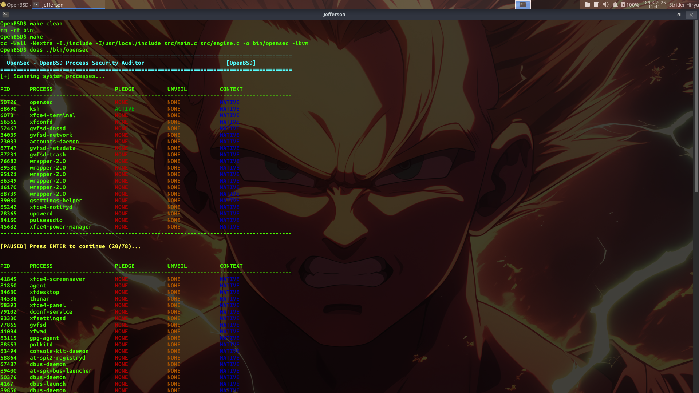
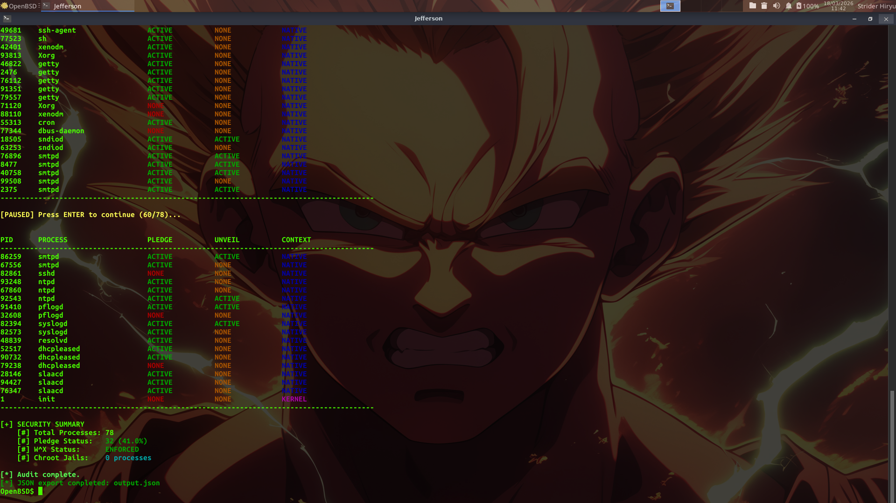
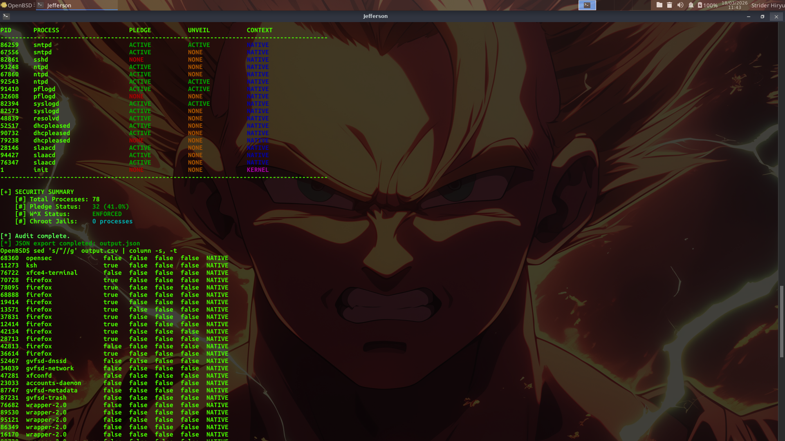

# 🐡 OpenSec

Lightweight OpenBSD process mitigation auditing tool focused on pledge, unveil, and W^X visibility.

[](https://www.openbsd.org)
[](https://gcc.gnu.org/)
[](LICENSE)


## ● Project Information

- **Project:** OpenSec (Open Security Auditor)
- **Author:** Jefferson Cesar Antunes
- **License:** MIT
- **Version:** 1.0.0
- **Description:** Passive kernel-state mitigation auditing tool for OpenBSD.

## ● Etymology & Origin

The name OpenSec was born from the fusion of Open and Security, directly inspired by the OpenBSD philosophy.

Open represents more than free software. It stands for transparency, auditability, and deterministic security design.

OpenSec reflects the principle that security tools must be inspectable, minimal, and free from hidden logic.  
It is security through clarity.

## ● Overview

OpenSec is a minimal forensic utility designed to audit process-level mitigation mechanisms on OpenBSD.

It inspects kernel-exposed process metadata through:

    kvm(3)
    struct kinfo_proc (kernel process table)

The tool evaluates whether active processes enforce core security primitives such as:

    pledge(2)
    unveil(2)

Additionally, it inspects kernel metadata that may indicate W^X enforcement behavior.

Classification is derived strictly from kernel-reported state.

OpenSec does not perform tracing, behavioral inference, or runtime instrumentation.

## ● Why

OpenBSD provides strong built-in mitigation primitives. However, visibility into which processes actively enforce them is not centralized.

OpenSec provides:

- Deterministic mitigation visibility
- System-wide process auditing
- Hardening validation support
- Live forensic triage assistance
- Security posture verification

## ● How It Works

OpenSec interfaces with **libkvm** to access the kernel process table in read-only mode.

For each active process, it evaluates fields within **struct kinfo_proc** to determine:

- Whether pledge restrictions are active
- Whether unveil restrictions are present
- Whether memory protection aligns with W^X principles

All inspection is passive.

The tool does not:

- Attach via ptrace
- Inject code
- Modify process memory
- Suspend execution
- Instrument binaries

## ● Example Output

```text
PID      PROCESS           PLEDGE          UNVEIL          CONTEXT
--------------------------------------------------------------------
89905    opensec           NONE            NONE            NATIVE
80996    ksh               ACTIVE          NONE            NATIVE
96837    xfce4-terminal    NONE            NONE            NATIVE
20033    firefox           ACTIVE          NONE            NATIVE
18100    firefox           NONE            NONE            NATIVE
79750    accounts-daemon   NONE            NONE            NATIVE
```

*Output reflects kernel-reported mitigation state only.*

## ● Project in Action


*1- Real-time process audit showing security pledges and mitigations.*


*2- JSON output for structured analysis of processes.*


*3- Clean, tabulated view of all processes with security context (using sed for formatting).*

## ● Features

- Kernel process table inspection via `libkvm`
- `pledge(2)` enforcement detection
- `unveil(2)` state reporting
- W^X-related enforcement indicators
- Deterministic classification model
- Clean terminal output
- Minimal runtime footprint

## ● Operational Integrity

OpenSec is built for stability and forensic neutrality:

- Read-only kernel state access
- No process interruption
- No execution state modification
- Graceful handling of restricted entries

## ● Investigation Workflow

After identifying processes without active mitigations, analysts may proceed with:

```bash
# Syscall auditing
ktrace -p [PID] && kdump
```

```bash
# File descriptor inspection
fstat -p [PID]
```

```bash
# Binary verification
sha256 /path/to/binary
``` 

OpenSec serves as a mitigation visibility layer within a broader forensic workflow.

## ● Deployment

**Requirements:**

- OpenBSD (release or -current)
- libkvm
- BSD make
- doas or root privileges

## ● Build and Run

```bash
# Clone the repository
git clone https://github.com/jeffersoncesarantunes/OpenSec.git
cd OpenSec

# Build (clean old binaries first)
make clean && make

# Standard execution
doas ./bin/opensec

# Silent mode (Export only, no terminal pollution)
doas ./bin/opensec --format json --quiet
doas ./bin/opensec --format csv --quiet

# Integrity audit
doas ./bin/opensec --check-integrity
``` 

## ● Repository Structure

```text
├── bin/                # Compiled binaries (Ignored by .gitignore)
├── docs/               # Technical specs, Benchmarks & Security model
├── examples/           # Sample outputs (JSON/CSV) and baselines
├── Imagens/            # OpenSec screenshots and execution flow
├── include/            # Header files (.h) - Interface definitions
│   └── opensec.h       # Main header (Constants & Prototypes)
├── src/                # Core implementation (.c) - Engine logic
│   ├── engine.c        # Audit logic & Process mitigation checks
│   └── main.c          # Entry point and CLI argument parsing
├── LICENSE             # MIT License terms
├── Makefile            # Build system (POSIX compliant)
└── README.md           # Project entry point and manual
```

### Notes

- `src/` contains the core auditing engine and execution flow  
- `include/` defines shared interfaces and structures  
- `docs/` includes the security model and performance benchmarks  
- `examples/` provides baseline and sample outputs for analysis  
- `bin/` contains the compiled binary (built locally)

## ● Export Formats

OpenSec can generate structured output for further analysis or reporting.

### CSV Export
```bash
doas ./bin/opensec --format csv
```

Sample snippet (output.csv):
```csv
pid,name,pledge,unveil,wxneeded,chrooted,context
19286,opensec,0,0,0,0,NATIVE
85953,firefox,1,0,0,0,NATIVE
...
```

### JSON Export
```bash
doas ./bin/opensec --format json
```

Sample snippet (output.json):
```json
[
  {
    "pid": 19286,
    "name": "opensec",
    "pledge": false,
    "unveil": false,
    "wxneeded": false,
    "chrooted": false,
    "context": "NATIVE"
  },
  {
    "pid": 85953,
    "name": "firefox",
    "pledge": true,
    "unveil": false,
    "wxneeded": false,
    "chrooted": false,
    "context": "NATIVE"
  }
]
```

- Choose the format with `--format json` or `--format csv`. If omitted, OpenSec prints output to the terminal only.

## ● Integrity Verification

OpenSec can verify the integrity of critical system binaries by comparing their current SHA256 hashes against a trusted baseline.

### 1. Create a Baseline
Generate a `baseline.json` file in a known secure state:

```json
{
  "/bin/ls" : "$(sha256 -q /bin/ls)",
  "/usr/bin/ssh" : "$(sha256 -q /usr/bin/ssh)",
  "/usr/bin/doas" : "$(sha256 -q /usr/bin/doas)"
}
```

### 2. Audit Integrity
Run the audit against your baseline:

```bash
doas ./bin/opensec --check-integrity
```

**Note:** Use the --quiet flag to suppress output unless a mismatch is found (ideal for cron jobs).

## ● Tech Stack

- **Language:** C (C99/C11 with OpenBSD extensions)
- **Kernel Interface:** libkvm
- **Data Source:** struct kinfo_proc
- **Build Tool:** BSD make
- **Target Platform:** OpenBSD

## ● Roadmap

- [x] Core mitigation auditing engine
- [x] pledge(2) / unveil(2) visibility
- [x] Kernel state extraction via libkvm(3)
- [x] Structured export formats (JSON / CSV)
- [x] Integration with sha256 for binary integrity validation
- [x] Silent mode for automation (--quiet)
- [ ] Fine-grained W^X violation detection

## ● License

Distributed under the MIT License. See [LICENSE](./LICENSE) for details.
